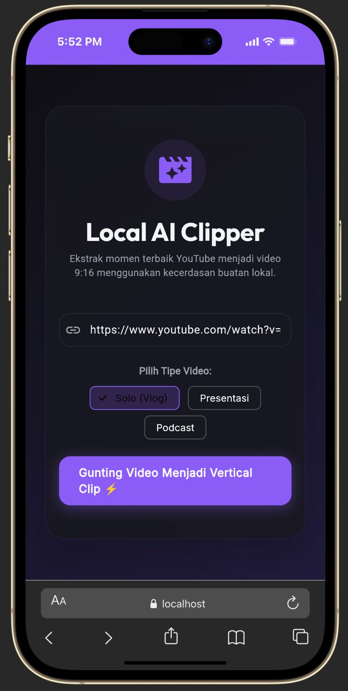
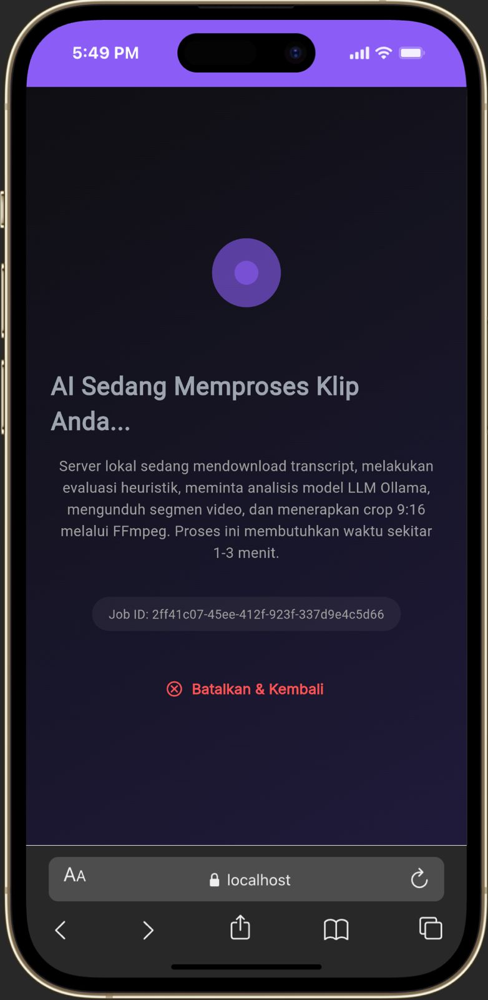
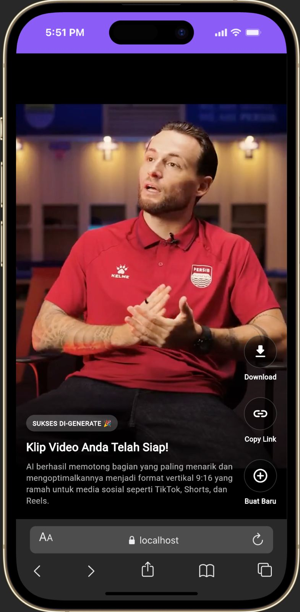

# ✂️ Local AI Clipper

**Local AI Clipper** adalah platform otomasi berparadigma _local-first_ yang secara otomatis mengubah video YouTube menjadi _vertical clip_ (9:16) yang engaging, sangat cocok untuk TikTok, Shorts, dan Reels.

Sistem ini memprioritaskan efisiensi memori dan privasi dengan mengeksekusi LLM serta pemrosesan media secara lokal 100%, tanpa ketergantungan pada _cloud API_ pihak ketiga.

---

## ✨ Fitur Utama

- **Heuristic Pre-Filtering**: Secara cerdas menganalisa transkrip video YouTube untuk menemukan momen paling menarik menggunakan _density score_ (berdasarkan tanda baca dan kata emosional) sebelum melibatkan LLM, sehingga sangat menghemat waktu inferensi.
- **Local LLM Integration**: Memanfaatkan model Llama 3.2 via Ollama untuk menentukan _timestamp_ awal dan akhir klip yang presisi secara lokal.
- **Dynamic Video Layouting**: Memiliki 3 mode pemotongan FFmpeg yang super cepat (_Fast Seeking_):
  - **Solo (Vlog)**: Pemotongan tengah (Center Crop) yang efisien.
  - **Presentasi**: Efek latar belakang _blur_ ala konten edukasi/reels.
  - **Podcast**: Layar terbagi (_Split Screen/Vertical Stack_).
- **TikTok-Style Web Dashboard**: Antarmuka Flutter Web premium dengan _dark mode_, animasi mulus, dan _player_ video berdesain TikTok.

---

## 📸 Screenshots

_(Tambahkan tangkapan layar aplikasi Anda ke folder `assets/screenshoot/` dan tampilkan di sini)_





---

## 🛠️ Tech Stack

### Backend

- **Bahasa**: Go (Golang 1.21+)
- **Web Framework**: Gin HTTP
- **Arsitektur**: Modulith / Package-by-Feature dengan _In-Memory State_ (_Thread-Safe_)
- **AI Engine**: Ollama (Llama 3.2)
- **Media Toolkit**: FFmpeg (Media Processing), yt-dlp (Video/Transcript Downloader)

### Frontend

- **Framework**: Flutter (Target: Web)
- **State Management**: Provider
- **HTTP Client**: Dio
- **Media Player**: `media_kit` & `media_kit_video`

---

## 🚀 Cara Menjalankan Aplikasi

### Prasyarat

Pastikan Anda telah menginstal beberapa alat berikut di sistem Anda (MacOS/Linux/Windows):

- [Go](https://go.dev/) (versi 1.21 atau terbaru)
- [Flutter SDK](https://docs.flutter.dev/get-started/install)
- [Ollama](https://ollama.com/) (Jangan lupa jalankan: `ollama pull llama3.2`)
- `ffmpeg` dan `yt-dlp` (Tersedia via Homebrew: `brew install ffmpeg yt-dlp`)

### 1. Menjalankan Backend (Go)

Buka terminal dan arahkan ke folder `backend`:

```bash
cd backend
go mod tidy
go run api/main.go
```

_Server akan berjalan di `http://localhost:8080`._

### 2. Menjalankan Frontend (Flutter Web)

Buka terminal baru dan arahkan ke folder `frontend`:

```bash
cd frontend
flutter pub get
flutter run -d chrome --web-renderer html
```

_Atau, untuk melakukan build statis web:_

```bash
flutter build web
```

---

## 📂 Struktur Direktori

```text
ClipperAi/
├── assets/
│   └── screenshoot/         # Folder untuk tangkapan layar aplikasi
├── backend/
│   ├── api/                 # Entry point server Go (main.go)
│   ├── internal/
│   │   ├── clip/            # Domain logic (Handler, Service, State)
│   │   └── pkg/             # Wrapper untuk FFmpeg & Ollama
│   └── outputs/             # Tempat penyimpanan sementara hasil video
├── docs/                    # Dokumentasi lengkap proyek (API, Plan, Code Convention)
├── frontend/
│   ├── lib/
│   │   ├── core/            # Theme, API Client
│   │   └── features/        # Komponen UI (Model, Provider, Views)
│   └── web/                 # File build web (index.html)
└── README.md
```

---

## 📜 Dokumentasi Lebih Lanjut

- [Backend API Documentation](docs/backend-api.md)
- [Frontend Implementation Plan](docs/plan-frontend.md)
- [Code Convention](docs/code-convention.md)

---

_Dibuat oleh AI Clipper Dev Team_
