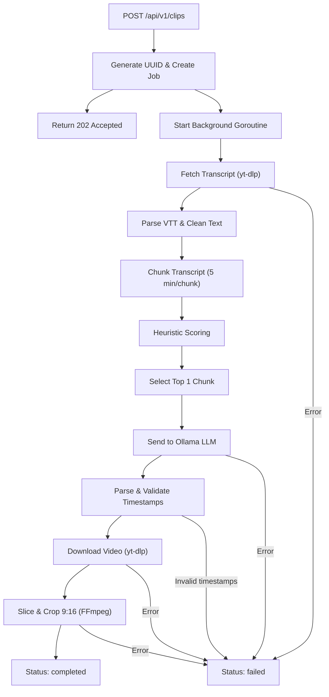

# Local AI Clipper — Backend API Documentation

> **Version**: 1.0 (MVP)
> **Base URL**: `http://localhost:8080`
> **Framework**: Go (Gin HTTP)
> **Last Updated**: 2026-06-02

---

## Table of Contents

- [Overview](#overview)
- [Prerequisites](#prerequisites)
- [Getting Started](#getting-started)
- [API Endpoints](#api-endpoints)
  - [Submit Clip Job](#1-submit-clip-job)
  - [Get Job Status](#2-get-job-status)
  - [Cancel Clip Job](#3-cancel-clip-job)
- [Processing Pipeline](#processing-pipeline)
- [Architecture](#architecture)
  - [Directory Structure](#directory-structure)
  - [Module Overview](#module-overview)
- [Configuration](#configuration)
- [Error Handling](#error-handling)
- [Heuristic Scoring](#heuristic-scoring)
- [Known Limitations](#known-limitations)

---

## Overview

Local AI Clipper is an automation platform that automatically converts YouTube videos into short vertical clips (9:16). It runs completely on your local machine, requiring no third-party cloud services.

**Core Workflow:**
1. The client sends a YouTube URL.
2. The backend extracts the transcript and identifies the most engaging segment using heuristic scoring.
3. A local LLM (Ollama) calculates the exact timestamps.
4. FFmpeg slices and crops the video into a 9:16 vertical layout.

---

## Prerequisites

Ensure the following tools are installed and available in your `$PATH`:

| Tool | Minimum Version | Installation (macOS) |
|------|-----------------|----------------------|
| **Go** | 1.21+ | `brew install go` |
| **yt-dlp** | 2024.x+ | `brew install yt-dlp` |
| **FFmpeg** | 6.x+ | `brew install ffmpeg` |
| **Ollama** | 0.1.x+ | [ollama.com](https://ollama.com) |
| **Ollama Model** | llama3.2 | `ollama pull llama3.2` |

---

## Getting Started

```bash
# 1. Navigate to the backend directory
cd backend

# 2. Install dependencies
go mod tidy

# 3. Start Ollama and download the model (in a separate terminal)
ollama serve
ollama pull llama3.2

# 4. Start the server
go run ./api/main.go
```

The server will be available at `http://localhost:8080`.

---

## API Endpoints

### 1. Submit Clip Job

Submits a YouTube URL to be processed into a vertical clip.

```
POST /api/v1/clips
```

**Request Headers:**
| Header | Value |
|--------|-------|
| `Content-Type` | `application/json` |

**Request Body:**
```json
{
  "youtube_url": "https://www.youtube.com/watch?v=VIDEO_ID",
  "layout_mode": "solo"
}
```

| Field | Type | Required | Description |
|-------|------|----------|-------------|
| `youtube_url` | string | ✅ | A valid YouTube video URL. |
| `layout_mode` | string | ❌ | Video layout mode: `solo`, `presentation`, or `podcast`. (Default: `solo`) |

**Response: `202 Accepted`**
```json
{
  "job_id": "5656dfc2-6938-4e79-acd1-4cddbb633426"
}
```

**Error Responses:**

| Status | Body | Condition |
|--------|------|-----------|
| `400 Bad Request` | `{"error": "Invalid JSON body"}` | The JSON payload is malformed. |
| `400 Bad Request` | `{"error": "youtube_url is required"}` | The `youtube_url` field is missing or empty. |

**cURL Example:**
```bash
curl -X POST http://localhost:8080/api/v1/clips \
  -H "Content-Type: application/json" \
  -d '{"youtube_url": "https://www.youtube.com/watch?v=PLzyNrAISx8", "layout_mode": "presentation"}'
```

---

### 2. Get Job Status

Polls the processing status of a specific job using its `job_id`.

```
GET /api/v1/clips/:id
```

**Path Parameters:**
| Parameter | Type | Description |
|-----------|------|-------------|
| `id` | string (UUID) | The job ID obtained from the submit endpoint. |

**Response: `200 OK`**

Jobs transition through the following states:

#### Status: `processing`
```json
{
  "id": "5656dfc2-6938-4e79-acd1-4cddbb633426",
  "status": "processing"
}
```

#### Status: `completed`
```json
{
  "id": "5656dfc2-6938-4e79-acd1-4cddbb633426",
  "status": "completed",
  "video_path": "outputs/output_clip_5656dfc2-6938-4e79-acd1-4cddbb633426.mp4"
}
```

#### Status: `failed`
```json
{
  "id": "5656dfc2-6938-4e79-acd1-4cddbb633426",
  "status": "failed",
  "error": "failed to fetch transcript: ... (or 'Job cancelled by user')"
}
```

**Error Responses:**

| Status | Body | Condition |
|--------|------|-----------|
| `404 Not Found` | `{"error": "Job not found"}` | The requested job ID does not exist. |

**Response Schema:**

| Field | Type | Presence | Description |
|-------|------|----------|-------------|
| `id` | string | Always | The job UUID. |
| `status` | string | Always | `processing` \| `completed` \| `failed` |
| `video_path` | string | When `completed` | The relative path to the generated video file. |
| `error` | string | When `failed` | The error message explaining why the job failed. |

**cURL Example:**
```bash
curl -i http://localhost:8080/api/v1/clips/5656dfc2-6938-4e79-acd1-4cddbb633426
```

---

### 3. Cancel Clip Job

Cancels a background job in real-time. This leverages `context.CancelFunc` to immediately terminate external processes like FFmpeg and yt-dlp, freeing up system resources.

```
DELETE /api/v1/clips/:id
```

**Path Parameters:**
| Parameter | Type | Description |
|-----------|------|-------------|
| `id` | string (UUID) | The ID of the job to cancel. |

**Response: `200 OK`**
```json
{
  "message": "Job cancellation requested successfully"
}
```

**Error Responses:**
| Status | Body | Condition |
|--------|------|-----------|
| `404 Not Found` | `{"error": "Job not found"}` | The requested job ID does not exist. |

**cURL Example:**
```bash
curl -X DELETE http://localhost:8080/api/v1/clips/5656dfc2-6938-4e79-acd1-4cddbb633426
```

---

## Processing Pipeline

This is the internal workflow triggered once a job is submitted:



### Pipeline Details:

| Step | Component | Description | Timeout |
|------|-----------|-------------|---------|
| 1 | `handler.go` | Receives the request, generates a UUID, and returns `202 Accepted`. | - |
| 2 | `executor.go` | Fetches subtitles via `yt-dlp --write-auto-sub`. | 10 min (context) |
| 3 | `executor.go` | Parses the VTT file, removes noise, and injects `[HH:MM:SS]` timestamps into the text. | - |
| 4 | `service.go` | Splits the transcript into chunks (~750 words per chunk). | - |
| 5 | `service.go` | Applies heuristic scoring to each chunk (see [Heuristic Scoring](#heuristic-scoring)). | - |
| 6 | `client.go` | Sends the highest-scoring chunk to Ollama and parses the JSON response. | 120s (HTTP) |
| 7 | `service.go` | Validates timestamps (start < end, duration between 10-120s). | - |
| 8 | `executor.go` | Downloads the video using `yt-dlp` in MP4 format. | 10 min (context) |
| 9 | `executor.go` | Slices and crops the video to 9:16 using FFmpeg (libx264, yuv420p). | 10 min (context) |

---

## Architecture

### Directory Structure

```
backend/
├── api/
│   └── main.go                     # Entry point, Gin router, dependency wiring
├── internal/
│   ├── clip/
│   │   ├── handler.go              # HTTP handlers (POST, GET, DELETE)
│   │   ├── service.go              # Orchestration, chunking, scoring
│   │   └── state.go                # Thread-safe in-memory job store
│   └── pkg/
│       ├── ollama/
│       │   └── client.go           # Ollama HTTP client
│       └── ffmpeg/
│           └── executor.go         # yt-dlp & FFmpeg wrappers
├── outputs/                        # Generated video clips
├── go.mod
└── go.sum
```

### Module Overview

#### `internal/clip/state.go` — Job State Manager

Maintains job states safely across goroutines using `sync.RWMutex`.

| Method | Lock Type | Description |
|--------|-----------|-------------|
| `NewJobStore()` | - | Constructor |
| `CreateJob(id, cancel)` | Write | Creates a new job and attaches a `context.CancelFunc`. |
| `GetJob(id)` | Read | Retrieves a copy of a job to prevent race conditions. |
| `CompleteJob(id, path)` | Write | Marks the job as completed and stores the video path. |
| `FailJob(id, err)` | Write | Marks the job as failed and stores the error message. |
| `CancelJob(id)` | Write | Executes the `CancelFunc` and transitions the job to failed. |

> **Note**: `GetJob` returns a copy of the `Job` struct rather than a direct pointer to the map data, preventing accidental concurrent mutations.

#### `internal/clip/service.go` — Orchestration

Manages the core workflow from transcript fetching to video slicing.

**Helper Functions:**

| Function | Description |
|----------|-------------|
| `chunkTranscript(text, minutes)` | Splits the transcript based on estimated word counts (150 words ≈ 1 minute). |
| `scoreChunks(chunks)` | Evaluates each chunk based on the heuristic scoring system. |
| `parseTimeToSeconds(ts)` | Converts timestamp strings to integer seconds (supports `HH:MM:SS`, `MM:SS`, or raw seconds). |
| `secondsToFFmpegTime(sec)`| Formats integer seconds back to `HH:MM:SS`. |

#### `internal/pkg/ollama/client.go` — Ollama LLM Client

Handles HTTP communication with the local Ollama service.

| Setting | Value |
|---------|-------|
| Base URL | `http://localhost:11434` |
| Model | `llama3.2` |
| HTTP Timeout | 120 seconds |
| Stream | `false` |
| Endpoint | `POST /api/generate` |

**Prompt Strategy**: The transcript chunk sent to the LLM includes inline `[HH:MM:SS]` timestamps. The model is strictly instructed to only extract time ranges that actually exist within the provided text, preventing hallucinations.

#### `internal/pkg/ffmpeg/executor.go` — Media Processing

| Function | Tool | Description |
|----------|------|-------------|
| `FetchTranscript` | yt-dlp | Downloads VTT subtitles (supports ID and EN). |
| `parseVTT` | - | Parses VTT into plain text with inline timestamps. |
| `DownloadVideo` | yt-dlp | Downloads the raw video in MP4 format. |
| `SliceAndCrop` | FFmpeg | Slices the specific segment and crops it to 9:16. |

**FFmpeg Flags:**

| Flag | Purpose |
|------|---------|
| `-vf crop...` / `-filter_complex` | Layout modifications depending on the `layout_mode`. |
| `-c:v libx264` | H.264 video codec. |
| `-preset fast` | Balances encoding speed and CPU usage. |
| `-pix_fmt yuv420p` | Ensures compatibility with QuickTime and Safari. |
| `-c:a aac` | Standard AAC audio codec. |
| `-movflags +faststart` | Optimizes the MP4 file for fast web streaming. |

---

## Configuration

The backend is configured via a `.env` file in the `backend/` directory (parsed using `godotenv`). If the file is missing, the server defaults to the following values:

| Environment Variable | Default Value | Description |
|----------------------|---------------|-------------|
| `PORT` | `8080` | The HTTP port the server listens on. |
| `OLLAMA_URL` | `http://localhost:11434` | The base URL for the local Ollama instance. |
| `OLLAMA_MODEL` | `llama3.2` | The LLM model to query. |
| `OUTPUT_DIR` | `outputs` | The folder where final clips are saved. |

> **Note**: The server automatically creates the `OUTPUT_DIR` during startup if it doesn't already exist.

**Example `.env` file:**
```env
PORT=8080
OLLAMA_URL=http://localhost:11434
OLLAMA_MODEL=llama3.2
OUTPUT_DIR=outputs
```

---

## Error Handling

All errors are wrapped with context using `fmt.Errorf("...: %w", err)` to maintain clean error traces, as per the `docs/code-convention.md`.

### Error Boundaries

If an error occurs inside the background goroutine (`ProcessClip`):

1. **Recoverable Errors**: The job's state is updated to `failed` with a descriptive message.
2. **Panics**: Handled safely via a `defer recover()`, ensuring the server stays up and the job is marked as `failed`.

### Common Error Messages

| Error Message | Typical Cause |
|---------------|---------------|
| `failed to fetch transcript: yt-dlp transcript fetch failed` | `yt-dlp` isn't installed, or the video has no auto-generated subtitles. |
| `LLM failed to find timestamps: failed to parse JSON from LLM` | Ollama hallucinated or returned malformed JSON. |
| `clip duration X seconds is out of range (10-120s)` | The LLM generated a time range that is too short or excessively long. |
| `failed to download video: yt-dlp download failed` | Network issues, or the video is private/age-restricted. |
| `output clip file is suspiciously small (X bytes)` | FFmpeg failed mid-processing, usually due to invalid timestamps spanning beyond the video duration. |

---

## Heuristic Scoring

Before sending the text to the LLM, the system selects the most engaging transcript chunk (approximately 5 minutes long) using a heuristic scoring algorithm:

| Indicator | Points | Rationale |
|-----------|--------|-----------|
| `?` (Question Mark) | +3 per occurrence | Indicates an interactive or thought-provoking moment. |
| `!` (Exclamation Mark) | +2 per occurrence | Indicates excitement or strong emotion. |
| Emotional Keywords | +2 per occurrence | Flags dramatic, shocking, or highly engaging segments. |

**Example Keywords:**
```
tapi, masalahnya, gila, sebenarnya, ternyata, wow, amazing, 
shocking, seriously, actually, honestly, crazy
```

The chunk with the highest score is the only one sent to the LLM, saving significant inference time.

---

## Known Limitations

| Limitation | Description | Potential Solution |
|------------|-------------|--------------------|
| **In-Memory State** | All jobs are lost if the server restarts. | Use an SQLite database or a persistent key-value store. |
| **No Queue System** | Every incoming request immediately spawns a goroutine, which could overload the CPU under heavy traffic. | Implement a robust worker pool or message queue (e.g., Redis). |
| **No Authentication** | The API is entirely public. | Add API key middleware. |
| **HTTP 429 (Rate Limit)** | YouTube blocks IP addresses that fetch subtitles too aggressively. | Use cookies, rotating proxies, or implement exponential backoff. |
| **LLM Accuracy** | `llama3.2` (3B parameters) can sometimes return slightly inaccurate timestamps. | Use a larger model or implement fallback parsing logic. |
| **No Cleanup Routine** | The `outputs/` folder will grow indefinitely. | Add a cron job or a dedicated cleanup endpoint to delete old clips. |
