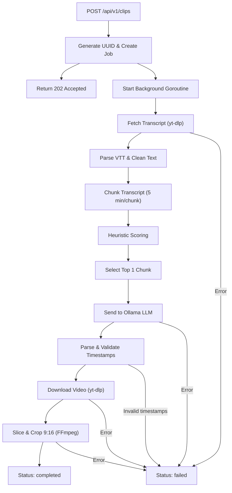

# Local AI Clipper — Backend API Documentation

> **Version**: 1.0 (MVP)
> **Base URL**: `http://localhost:8080`
> **Framework**: Go (Gin HTTP)
> **Last Updated**: 2026-06-02

---

## Table of Contents

- [Overview](#overview)
- [Prerequisites](#prerequisites)
- [Getting Started](#getting-started)
- [API Endpoints](#api-endpoints)
  - [Submit Clip Job](#1-submit-clip-job)
  - [Get Job Status](#2-get-job-status)
  - [Cancel Clip Job](#3-cancel-clip-job)
- [Processing Pipeline](#processing-pipeline)
- [Architecture](#architecture)
  - [Directory Structure](#directory-structure)
  - [Module Overview](#module-overview)
- [Configuration](#configuration)
- [Error Handling](#error-handling)
- [Heuristic Scoring](#heuristic-scoring)
- [Known Limitations](#known-limitations)

---

## Overview

Local AI Clipper adalah platform otomasi lokal yang mengubah video YouTube menjadi clip vertikal (9:16) pendek secara otomatis. Sistem ini bekerja sepenuhnya di mesin lokal tanpa memerlukan cloud service.

**Alur kerja utama:**
1. Client mengirim URL YouTube
2. Backend mengekstrak transcript, memilih segmen paling menarik melalui heuristic scoring
3. LLM lokal (Ollama) menentukan timestamp yang tepat
4. FFmpeg memotong dan mengubah video menjadi format vertikal 9:16

---

## Prerequisites

Pastikan tools berikut terinstal dan dapat diakses dari `$PATH`:

| Tool | Versi Minimum | Instalasi (macOS) |
|------|--------------|-------------------|
| **Go** | 1.21+ | `brew install go` |
| **yt-dlp** | 2024.x+ | `brew install yt-dlp` |
| **FFmpeg** | 6.x+ | `brew install ffmpeg` |
| **Ollama** | 0.1.x+ | [ollama.com](https://ollama.com) |
| **Ollama Model** | llama3.2 | `ollama pull llama3.2` |

---

## Getting Started

```bash
# 1. Masuk ke direktori backend
cd backend

# 2. Install dependencies
go mod tidy

# 3. Pastikan Ollama berjalan dengan model llama3.2
ollama serve   # Di terminal terpisah
ollama pull llama3.2

# 4. Jalankan server
go run ./api/main.go
```

Server akan berjalan di `http://localhost:8080`.

---

## API Endpoints

### 1. Submit Clip Job

Mengirim URL YouTube untuk diproses menjadi clip vertikal.

```
POST /api/v1/clips
```

**Request Headers:**
| Header | Value |
|--------|-------|
| `Content-Type` | `application/json` |

**Request Body:**
```json
{
  "youtube_url": "https://www.youtube.com/watch?v=VIDEO_ID",
  "layout_mode": "solo"
}
```

| Field | Type | Required | Description |
|-------|------|----------|-------------|
| `youtube_url` | string | ✅ | URL video YouTube yang valid |
| `layout_mode` | string | ❌ | Mode tata letak video: `solo`, `presentation`, atau `podcast`. (Default: `solo`) |

**Response: `202 Accepted`**
```json
{
  "job_id": "5656dfc2-6938-4e79-acd1-4cddbb633426"
}
```

**Error Responses:**

| Status | Body | Kondisi |
|--------|------|---------|
| `400 Bad Request` | `{"error": "Invalid JSON body"}` | Body JSON tidak valid |
| `400 Bad Request` | `{"error": "youtube_url is required"}` | Field `youtube_url` kosong |

**Contoh cURL:**
```bash
curl -X POST http://localhost:8080/api/v1/clips \
  -H "Content-Type: application/json" \
  -d '{"youtube_url": "https://www.youtube.com/watch?v=PLzyNrAISx8", "layout_mode": "presentation"}'
```

---

### 2. Get Job Status

Polling status pemrosesan job berdasarkan `job_id`.

```
GET /api/v1/clips/:id
```

**Path Parameters:**
| Parameter | Type | Description |
|-----------|------|-------------|
| `id` | string (UUID) | Job ID yang diperoleh dari endpoint Submit |

**Response: `200 OK`**

Status job berubah melalui 3 state berikut:

#### Status: `processing`
```json
{
  "id": "5656dfc2-6938-4e79-acd1-4cddbb633426",
  "status": "processing"
}
```

#### Status: `completed`
```json
{
  "id": "5656dfc2-6938-4e79-acd1-4cddbb633426",
  "status": "completed",
  "video_path": "outputs/output_clip_5656dfc2-6938-4e79-acd1-4cddbb633426.mp4"
}
```

#### Status: `failed`
```json
{
  "id": "5656dfc2-6938-4e79-acd1-4cddbb633426",
  "status": "failed",
  "error": "failed to fetch transcript: ... (atau 'Proses dibatalkan oleh pengguna')"
}
```

**Error Responses:**

| Status | Body | Kondisi |
|--------|------|---------|
| `404 Not Found` | `{"error": "Job not found"}` | Job ID tidak ditemukan |

**Response Schema:**

| Field | Type | Presence | Description |
|-------|------|----------|-------------|
| `id` | string | Selalu | UUID job |
| `status` | string | Selalu | `processing` \| `completed` \| `failed` |
| `video_path` | string | Saat `completed` | Path relatif ke file output video |
| `error` | string | Saat `failed` | Pesan error yang menjelaskan kegagalan |

**Contoh cURL:**
```bash
curl -i http://localhost:8080/api/v1/clips/5656dfc2-6938-4e79-acd1-4cddbb633426
```

---

### 3. Cancel Clip Job

Membatalkan pemrosesan clip yang sedang berjalan di background secara real-time. Ini memanggil `context.CancelFunc` untuk membunuh proses eksternal seperti FFmpeg atau yt-dlp secara instan, sehingga membebaskan CPU.

```
DELETE /api/v1/clips/:id
```

**Path Parameters:**
| Parameter | Type | Description |
|-----------|------|-------------|
| `id` | string (UUID) | Job ID yang ingin dibatalkan |

**Response: `200 OK`**
```json
{
  "message": "Job cancellation requested successfully"
}
```

**Error Responses:**
| Status | Body | Kondisi |
|--------|------|---------|
| `404 Not Found` | `{"error": "Job not found"}` | Job ID tidak ditemukan |

**Contoh cURL:**
```bash
curl -X DELETE http://localhost:8080/api/v1/clips/5656dfc2-6938-4e79-acd1-4cddbb633426
```

---

## Processing Pipeline

Berikut adalah alur pemrosesan yang terjadi setelah job di-submit:



### Detail Setiap Step:

| Step | Komponen | Deskripsi | Timeout |
|------|----------|-----------|---------|
| 1 | `handler.go` | Menerima request, generate UUID, return 202 | - |
| 2 | `executor.go` | Fetch subtitle `.vtt` via `yt-dlp --write-auto-sub` | 10 min (context) |
| 3 | `executor.go` | Parse file VTT, hapus noise, sisipkan penanda waktu `[HH:MM:SS]` | - |
| 4 | `service.go` | Split transcript menjadi chunks (~750 kata/chunk) | - |
| 5 | `service.go` | Heuristic scoring per chunk (lihat [Heuristic Scoring](#heuristic-scoring)) | - |
| 6 | `client.go` | Kirim top chunk ke Ollama, parse JSON response | 120s (HTTP) |
| 7 | `service.go` | Validasi timestamp (start < end, durasi 10-120s) | - |
| 8 | `executor.go` | Download video via `yt-dlp` format MP4 | 10 min (context) |
| 9 | `executor.go` | Potong & crop video dengan FFmpeg (libx264, yuv420p, 9:16) | 10 min (context) |

---

## Architecture

### Directory Structure

```
backend/
├── api/
│   └── main.go                     # Entry point, Gin router, dependency wiring
├── internal/
│   ├── clip/
│   │   ├── handler.go              # HTTP handlers (POST & GET)
│   │   ├── service.go              # Orchestration, chunking, scoring
│   │   └── state.go                # Thread-safe in-memory job store
│   └── pkg/
│       ├── ollama/
│       │   └── client.go           # Ollama HTTP client
│       └── ffmpeg/
│           └── executor.go         # yt-dlp & FFmpeg wrappers
├── outputs/                        # Generated video clips
├── go.mod
└── go.sum
```

### Module Overview

#### `internal/clip/state.go` — Job State Manager

Menyimpan state job secara thread-safe menggunakan `sync.RWMutex`.

| Method | Lock Type | Description |
|--------|-----------|-------------|
| `NewJobStore()` | - | Constructor |
| `CreateJob(id, cancel)` | Write | Buat job baru dengan `context.CancelFunc` |
| `GetJob(id)` | Read | Ambil copy dari job (mencegah race condition) |
| `CompleteJob(id, path)` | Write | Update status ke completed |
| `FailJob(id, err)` | Write | Update status ke failed |
| `CancelJob(id)` | Write | Eksekusi `CancelFunc` dan set status ke failed |

> **Penting**: `GetJob` mengembalikan *copy* dari struct Job, bukan pointer ke data internal map, untuk mencegah race condition.

#### `internal/clip/service.go` — Orchestration

Mengatur alur kerja utama dari transcript fetching hingga video slicing.

**Helper Functions:**

| Function | Description |
|----------|-------------|
| `chunkTranscript(text, minutes)` | Memecah transcript menjadi potongan berdasarkan estimasi waktu (150 kata ≈ 1 menit) |
| `scoreChunks(chunks)` | Memberikan skor heuristic ke setiap chunk |
| `parseTimeToSeconds(ts)` | Konversi timestamp string → integer detik (support `HH:MM:SS`, `MM:SS`, detik murni) |
| `secondsToFFmpegTime(sec)` | Konversi integer detik → string `HH:MM:SS` |

#### `internal/pkg/ollama/client.go` — Ollama LLM Client

Berkomunikasi dengan Ollama API lokal untuk analisis timestamp.

| Config | Value |
|--------|-------|
| Base URL | `http://localhost:11434` |
| Model | `llama3.2` |
| HTTP Timeout | 120 detik |
| Stream | `false` |
| Endpoint | `POST /api/generate` |

**Prompt Strategy**: Transcript yang dikirim mengandung penanda waktu inline `[HH:MM:SS]`. LLM diinstruksikan untuk **hanya** menggunakan timestamp yang ada di transcript, tidak mengarang sendiri.

#### `internal/pkg/ffmpeg/executor.go` — Media Processing

| Function | Tool | Description |
|----------|------|-------------|
| `FetchTranscript` | yt-dlp | Download subtitle VTT (bahasa: id, en) |
| `parseVTT` | - | Parse file VTT menjadi plain text dengan penanda waktu inline |
| `DownloadVideo` | yt-dlp | Download video dalam format MP4 |
| `SliceAndCrop` | FFmpeg | Potong video dan crop ke aspect ratio 9:16 |

**FFmpeg Flags:**

| Flag | Purpose |
|------|---------|
| `-vf crop...` / `-filter_complex ...` | Konversi dimensi dan efek layout sesuai `layout_mode` |
| `-c:v libx264` | Video codec H.264 |
| `-preset fast` | Encoding speed |
| `-pix_fmt yuv420p` | Kompatibilitas QuickTime Player |
| `-c:a aac` | Audio codec AAC |
| `-movflags +faststart` | Optimasi streaming MP4 |

---

## Configuration

## Configuration

Konfigurasi backend menggunakan file `.env` di dalam folder `backend/` (didukung oleh package `godotenv`). Jika file `.env` tidak ditemukan, server akan otomatis melakukan fallback ke nilai default berikut:

| Environment Variable | Default Value | Description |
|----------------------|---------------|-------------|
| `PORT` | `8080` | Port HTTP untuk menjalankan server |
| `OLLAMA_URL` | `http://localhost:11434` | Base URL untuk koneksi ke Ollama |
| `OLLAMA_MODEL` | `llama3.2` | Model LLM yang digunakan untuk analisa |
| `OUTPUT_DIR` | `outputs` | Direktori untuk menyimpan file output |

> **Catatan**: Direktori `OUTPUT_DIR` akan dibuat otomatis oleh server saat startup jika belum ada.

**Contoh file `.env`:**
```env
PORT=8080
OLLAMA_URL=http://localhost:11434
OLLAMA_MODEL=llama3.2
OUTPUT_DIR=outputs
```

Untuk konfigurasi tingkat lanjut (seperti durasi klip, chunk size, dsb), sementara masih di-hardcode di dalam source code (lihat `clip/service.go`).

---

## Error Handling

Semua error di-wrap dengan konteks menggunakan `fmt.Errorf("...: %w", err)` sesuai konvensi di `docs/code-convention.md`.

### Error Boundaries

Jika terjadi error di dalam background goroutine (`ProcessClip`):

1. **Recoverable errors** — Job di-update ke status `failed` dengan error message descriptif
2. **Panic** — Ditangkap oleh `defer recover()`, job di-update ke `failed` dengan pesan generic

### Contoh Error Messages

| Error | Penyebab |
|-------|----------|
| `failed to fetch transcript: yt-dlp transcript fetch failed` | yt-dlp tidak terinstal atau video tidak memiliki subtitle |
| `LLM failed to find timestamps: failed to parse JSON from LLM` | Ollama mengembalikan response yang bukan JSON valid |
| `clip duration X seconds is out of range (10-120s)` | LLM mengembalikan timestamp yang tidak masuk akal |
| `failed to download video: yt-dlp download failed` | Gagal download video (network/video private) |
| `output clip file is suspiciously small (X bytes)` | FFmpeg gagal memproses video (timestamp melampaui durasi video) |

---

## Heuristic Scoring

Sebelum mengirim transcript ke LLM, sistem memilih potongan (chunk) yang paling menarik menggunakan scoring heuristic:

| Indikator | Poin | Alasan |
|-----------|------|--------|
| `?` (tanda tanya) | +3 per kemunculan | Menandakan dialog interaktif, pertanyaan menarik |
| `!` (tanda seru) | +2 per kemunculan | Menandakan ekspresi emosional, antusiasme |
| Keyword emosional | +2 per kemunculan | Menandakan momen dramatis atau engaging |

**Keyword Emosional:**
```
tapi, masalahnya, gila, sebenarnya, ternyata, wow, amazing, 
shocking, seriously, actually, honestly, crazy
```

Chunk dengan skor tertinggi dipilih sebagai input untuk LLM.

---

## Known Limitations

| Limitasi | Deskripsi | Potensi Solusi |
|----------|-----------|----------------|
| **In-Memory State** | Job state hilang saat server restart | Gunakan SQLite atau file-based persistence |
| **Single Worker** | Tidak ada queue, setiap request langsung diproses di goroutine | Implementasi worker pool |
| **No Authentication** | API terbuka tanpa auth | Tambahkan API key middleware |
| **HTTP 429 (Rate Limit)** | YouTube mungkin mem-block download subtitle jika terlalu sering | Implementasi backoff/retry, atau gunakan cookie |
| **LLM Accuracy** | Model llama3.2 (3B params) kadang mengembalikan timestamp tidak akurat | Gunakan model yang lebih besar, atau tambahkan retry logic |
| **No Cleanup** | File temporary di `outputs/` harus dibersihkan manual | Tambahkan cron job atau cleanup endpoint |
