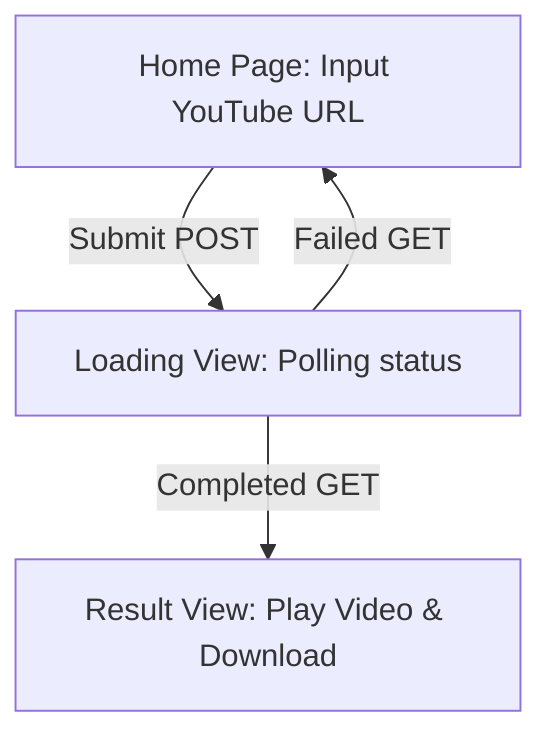

# Flutter Web Frontend — Implementation Plan (Step-by-Step)

> **Purpose of this document:** Provide precise technical guidance and instructions for building a web interface (MVP) using Flutter. This frontend will interact asynchronously (via polling) with the Local AI Clipper backend (Go) and deliver a modern, premium, and responsive user experience.

> **IMPORTANT:** Before executing any phase below, the agent **MUST** read and adhere to all coding conventions found in the `/docs/code-convention.md` file.

---

## 🎯 Application Overview
The Flutter Web client will serve as an elegant single-page dashboard featuring interactive process visualization:


---

## ⚙️ Architecture & Folder Reference

The folder structure adopts a **Feature-Based (Slicing by Feature)** approach to ensure modularity and scalability:

```text
ClipperAi/frontend/
├── web/                         # Standard Flutter Web configuration
├── lib/
│   ├── core/
│   │   ├── api_client.dart       # HTTP Client using Dio
│   │   └── theme.dart            # Design System & Premium Dark Theme
│   ├── features/
│   │   └── clip_generator/
│   │       ├── models/
│   │       │   └── job_response.dart # Data model mapping backend JSON
│   │       ├── providers/
│   │       │   └── clip_provider.dart # State manager & polling logic
│   │       └── views/
│   │           ├── home_page.dart     # Entry point view & layout wrapper
│   │           ├── loading_view.dart  # Animated status transition view
│   │           └── result_view.dart   # Video Player & Download/Copy buttons
│   └── main.dart                 # App setup & entry point
├── pubspec.yaml                 # Project dependencies
└── README.md
```

---

## 🚀 PHASE 0: Project Initialization & Dependencies

### Tasks:
1. Create a new Flutter project targeting **Web** inside the `ClipperAi/frontend/` folder:
   ```bash
   cd /Users/sgo-byan/project/ClipperAi
   flutter create --platforms=web frontend
   ```
2. Add the required dependencies to `pubspec.yaml` inside the `frontend` folder:
   ```yaml
   dependencies:
     flutter:
       sdk: flutter
     dio: ^5.4.0                  # Advanced HTTP Client
     provider: ^6.1.1             # Simple and clean state management
     media_kit: ^1.1.10           # Universal media player framework
     media_kit_video: ^1.1.10     # Video renderer widget for media_kit
     google_fonts: ^6.1.0         # Premium modern typography (Inter / Outfit)
     flutter_spinkit: ^5.2.0      # Premium loading animations
     url_launcher: ^6.2.5         # Open external links (for downloading)
     flutter_dotenv: ^5.1.0       # Dynamic handling of .env configuration files
   ```
3. Run `flutter pub get` to download all dependencies.

---

## ⚙️ PHASE 0.5: Environment Configuration (`.env` & `pubspec.yaml` Assets)

To avoid hardcoding configurations (like the backend base URL), we will use a `.env` file bundled as an application asset.

### Tasks:
1. Create a `.env` file in the root `frontend/` folder:
   ```env
   API_BASE_URL=http://localhost:8080
   ```
2. Register the `.env` file under the `assets` section in `pubspec.yaml` so Flutter can read it:
   ```yaml
   flutter:
     assets:
       - .env
   ```

---

## 🎨 PHASE 1: Premium Dark Theme & Design System (`core/theme.dart`)

To create a stunning first impression (the "Wow Effect"), use a premium dark mode color palette with smooth gradients (avoid pure flat black) and modern Google Fonts like Inter and Outfit.

```dart
// lib/core/theme.dart
import 'package:flutter/material.dart';
import 'package:google_fonts/google_fonts.dart';

class AppTheme {
  // Color Palette
  static const Color darkBg = Color(0xFF0F0F12);       // Deep background with purplish-gray tint
  static const Color cardBg = Color(0xFF181820);       // Card / container background
  static const Color primaryPurple = Color(0xFF8B5CF6); // Modern neon purple
  static const Color accentCyan = Color(0xFF06B6D4);    // Contrasting cyan for highlights
  static const Color textMain = Color(0xFFF3F4F6);     // Soft off-white
  static const Color textMuted = Color(0xFF9CA3AF);    // Muted gray text

  static ThemeData get darkTheme {
    return ThemeData(
      brightness: Brightness.dark,
      scaffoldBackgroundColor: darkBg,
      primaryColor: primaryPurple,
      colorScheme: const ColorScheme.dark(
        primary: primaryPurple,
        secondary: accentCyan,
        surface: cardBg,
        background: darkBg,
      ),
      textTheme: GoogleFonts.interTextTheme(ThemeData.dark().textTheme).copyWith(
        displayLarge: GoogleFonts.outfit(
          fontSize: 36,
          fontWeight: FontWeight.bold,
          color: textMain,
        ),
        titleLarge: GoogleFonts.outfit(
          fontSize: 22,
          fontWeight: FontWeight.w600,
          color: textMain,
        ),
        bodyLarge: const TextStyle(fontSize: 16, color: textMain),
        bodyMedium: const TextStyle(fontSize: 14, color: textMuted),
      ),
      inputDecorationTheme: InputDecorationTheme(
        filled: true,
        fillColor: cardBg.withOpacity(0.5),
        border: OutlineInputBorder(
          borderRadius: BorderRadius.circular(16),
          borderSide: BorderSide(color: primaryPurple.withOpacity(0.3)),
        ),
        focusedBorder: OutlineInputBorder(
          borderRadius: BorderRadius.circular(16),
          borderSide: const BorderSide(color: primaryPurple, width: 2),
        ),
        enabledBorder: OutlineInputBorder(
          borderRadius: BorderRadius.circular(16),
          borderSide: BorderSide(color: Colors.white.withOpacity(0.08)),
        ),
      ),
      elevatedButtonTheme: ElevatedButtonThemeData(
        style: ElevatedButtonStyleFrom(
          padding: const EdgeInsets.symmetric(horizontal: 28, vertical: 20),
          shape: RoundedRectangleBorder(
            borderRadius: BorderRadius.circular(16),
          ),
          backgroundColor: primaryPurple,
          foregroundColor: Colors.white,
        ),
      ),
    );
  }
}
```

---

## 📡 PHASE 2: API Client Wrapper (`core/api_client.dart`)

Create an HTTP wrapper using `Dio`. Dynamically read the `API_BASE_URL` value from the `.env` file using the `flutter_dotenv` package.

```dart
// lib/core/api_client.dart
import 'package:dio/dio.dart';
import 'package:flutter_dotenv/flutter_dotenv.dart';

class ApiClient {
  final Dio dio;

  ApiClient()
      : dio = Dio(
          BaseOptions(
            baseUrl: dotenv.env['API_BASE_URL'] ?? 'http://localhost:8080',
            connectTimeout: const Duration(seconds: 15),
            receiveTimeout: const Duration(seconds: 30),
            headers: {
              'Accept': 'application/json',
              'Content-Type': 'application/json',
            },
          ),
        );
}
```

---

## 📦 PHASE 3: Data Model (`features/clip_generator/models/job_response.dart`)

This data model maps the JSON status response returned by the Go server.

### JSON Response from GET `/api/v1/clips/:id`:
```json
{
  "id": "758509c3-...",
  "status": "processing",
  "video_path": "outputs/output_clip_758509c3-....mp4",
  "error": "Reason description if status is failed"
}
```

### Dart Model Implementation:
```dart
// lib/features/clip_generator/models/job_response.dart

enum ClipStatus { processing, completed, failed, unknown }

class JobResponse {
  final String id;
  final ClipStatus status;
  final String? videoPath;
  final String? error;

  JobResponse({
    required this.id,
    required this.status,
    this.videoPath,
    this.error,
  });

  factory JobResponse.fromJson(Map<String, dynamic> json) {
    ClipStatus mappedStatus;
    switch (json['status']) {
      case 'processing':
        mappedStatus = ClipStatus.processing;
        break;
      case 'completed':
        mappedStatus = ClipStatus.completed;
        break;
      case 'failed':
        mappedStatus = ClipStatus.failed;
        break;
      default:
        mappedStatus = ClipStatus.unknown;
    }

    return JobResponse(
      id: json['id'] ?? '',
      status: mappedStatus,
      videoPath: json['video_path'],
      error: json['error'],
    );
  }
}
```

---

## 🧠 PHASE 4: State Management & Polling Engine (`features/clip_generator/providers/clip_provider.dart`)

The primary state manager handles the flow of submitting a new video URL and executing periodic polling every 3 seconds.

```dart
// lib/features/clip_generator/providers/clip_provider.dart
import 'dart:async';
import 'package:flutter/material.dart';
import 'package:dio/dio.dart';
import '../../../core/api_client.dart';
import '../models/job_response.dart';

enum UIState { idle, submitting, loading, result, error }

class ClipProvider extends ChangeNotifier {
  final ApiClient _apiClient = ApiClient();
  
  UIState _state = UIState.idle;
  UIState get state => _state;

  String? _jobId;
  String? get jobId => _jobId;

  String? _videoUrl;
  String? get videoUrl => _videoUrl;

  String? _errorMessage;
  String? get errorMessage => _errorMessage;

  Timer? _pollingTimer;

  // Submit YouTube URL to trigger clip generation
  Future<void> submitYoutubeUrl(String youtubeUrl) async {
    _state = UIState.submitting;
    _errorMessage = null;
    _jobId = null;
    _videoUrl = null;
    notifyListeners();

    try {
      final response = await _apiClient.dio.post(
        '/api/v1/clips',
        data: {'youtube_url': youtubeUrl},
      );

      if (response.statusCode == 202) {
        _jobId = response.data['job_id'];
        _state = UIState.loading;
        notifyListeners();
        
        // Start asynchronous status polling
        _startPolling(_jobId!);
      } else {
        throw Exception('Server returned status code: ${response.statusCode}');
      }
    } on DioException catch (e) {
      _handleError(e.message ?? 'Failed to contact server.');
    } catch (e) {
      _handleError(e.toString());
    }
  }

  // Polling Engine: Check backend status every 3 seconds
  void _startPolling(String id) {
    _pollingTimer?.cancel();
    _pollingTimer = Timer.periodic(const Duration(seconds: 3), (timer) async {
      try {
        final response = await _apiClient.dio.get('/api/v1/clips/$id');
        
        if (response.statusCode == 200) {
          final job = JobResponse.fromJson(response.data);
          
          if (job.status == ClipStatus.completed) {
            timer.cancel();
            // Prefix the output path with the backend base URL
            final path = job.videoPath ?? '';
            final cleanPath = path.startsWith('/') ? path : '/$path';
            _videoUrl = '${_apiClient.dio.options.baseUrl}$cleanPath';
            
            _state = UIState.result;
            notifyListeners();
          } else if (job.status == ClipStatus.failed) {
            timer.cancel();
            _handleError(job.error ?? 'Backend failed to process the video clip.');
          }
          // If still 'processing', let the timer keep running
        }
      } catch (e) {
        // Tolerate temporary network errors during polling,
        // do not cancel the timer immediately unless errors are consecutive.
      }
    });
  }

  void _handleError(String message) {
    _pollingTimer?.cancel();
    _errorMessage = message;
    _state = UIState.error;
    notifyListeners();
  }

  // Reset state so the user can process a new video
  void reset() {
    _pollingTimer?.cancel();
    _state = UIState.idle;
    _jobId = null;
    _videoUrl = null;
    _errorMessage = null;
    notifyListeners();
  }

  @override
  void dispose() {
    _pollingTimer?.cancel();
    super.dispose();
  }
}
```

---

## 🖥️ PHASE 5: Main UI & Layout (`features/clip_generator/views/home_page.dart`)

The main page displays an elegant logo, modern text inputs, and dynamically swaps widgets/views based on the current state.

```dart
// lib/features/clip_generator/views/home_page.dart
import 'package:flutter/material.dart';
import 'package:provider/provider.dart';
import '../providers/clip_provider.dart';
import 'loading_view.dart';
import 'result_view.dart';

class HomePage extends StatefulWidget {
  const HomePage({super.key});

  @override
  State<HomePage> createState() => _HomePageState();
}

class _HomePageState extends State<HomePage> {
  final TextEditingController _urlController = TextEditingController();
  final _formKey = GlobalKey<FormState>();

  @override
  void dispose() {
    _urlController.dispose();
    super.dispose();
  }

  @override
  Widget build(BuildContext context) {
    final provider = Provider.of<ClipProvider>(context);

    // Dynamic state rendering
    switch (provider.state) {
      case UIState.loading:
        return const Scaffold(body: LoadingView());
      case UIState.result:
        return const Scaffold(body: ResultView());
      default:
        return Scaffold(
          body: Stack(
            children: [
              // Elegant Gradient Background Effect
              Container(
                decoration: const BoxDecoration(
                  gradient: LinearGradient(
                    colors: [Color(0xFF0F0F12), Color(0xFF1F1A3A)],
                    begin: Alignment.topLeft,
                    end: Alignment.bottomRight,
                  ),
                ),
              ),
              Center(
                child: SingleChildScrollView(
                  padding: const EdgeInsets.all(24.0),
                  child: Container(
                    constraints: const BoxConstraints(maxWidth: 600),
                    child: Card(
                      color: Theme.of(context).cardColor.withOpacity(0.85),
                      elevation: 32,
                      shadowColor: Colors.black.withOpacity(0.5),
                      shape: RoundedRectangleBorder(
                        borderRadius: BorderRadius.circular(28),
                        side: BorderSide(
                          color: Theme.of(context).primaryColor.withOpacity(0.1),
                        ),
                      ),
                      child: Padding(
                        padding: const EdgeInsets.symmetric(
                          horizontal: 40,
                          vertical: 48,
                        ),
                        child: Form(
                          key: _formKey,
                          child: Column(
                            mainAxisSize: MainAxisSize.min,
                            children: [
                              // Header Logo & Glow Effect
                              _buildHeader(context),
                              const SizedBox(height: 48),
                              
                              // Input URL
                              TextFormField(
                                controller: _urlController,
                                keyboardType: TextInputType.url,
                                decoration: const InputDecoration(
                                  hintText: 'Enter YouTube link (e.g., https://...)',
                                  prefixIcon: Icon(Icons.link, color: Colors.grey),
                                ),
                                validator: (value) {
                                  if (value == null || value.trim().isEmpty) {
                                    return 'URL cannot be empty';
                                  }
                                  if (!value.contains('youtube.com') &&
                                      !value.contains('youtu.be')) {
                                    return 'Please enter a valid YouTube link';
                                  }
                                  return null;
                                },
                              ),
                              const SizedBox(height: 24),
                              
                              // Layout Selection (Placeholders for UI)
                              const Text('Select Video Type:', style: TextStyle(fontWeight: FontWeight.bold, fontSize: 14)),
                              const SizedBox(height: 12),
                              Wrap(
                                spacing: 12.0,
                                runSpacing: 8.0,
                                alignment: WrapAlignment.center,
                                children: [
                                  ChoiceChip(
                                    label: const Text('Solo (Vlog)'),
                                    selected: true, // Example static selection
                                    onSelected: (selected) {},
                                    selectedColor: Theme.of(context).primaryColor.withOpacity(0.2),
                                    side: BorderSide(color: Theme.of(context).primaryColor),
                                  ),
                                  // (Add more chips for 'presentation' and 'podcast' here)
                                ],
                              ),
                              const SizedBox(height: 24),
                              
                              // Error Banner
                              if (provider.state == UIState.error) ...[
                                Container(
                                  padding: const EdgeInsets.all(16),
                                  decoration: BoxDecoration(
                                    color: Colors.red.withOpacity(0.1),
                                    borderRadius: BorderRadius.circular(12),
                                    border: BorderSide(
                                      color: Colors.red.withOpacity(0.3),
                                    ),
                                  ),
                                  child: Row(
                                    children: [
                                      const Icon(Icons.error_outline, color: Colors.redAccent),
                                      const SizedBox(width: 12),
                                      Expanded(
                                        child: Text(
                                          provider.errorMessage ?? 'A system error occurred.',
                                          style: const TextStyle(color: Colors.redAccent),
                                        ),
                                      ),
                                    ],
                                  ),
                                ),
                                const SizedBox(height: 24),
                              ],

                              // Submit Button
                              SizedBox(
                                width: double.infinity,
                                child: Container(
                                  decoration: BoxDecoration(
                                    borderRadius: BorderRadius.circular(16),
                                    boxShadow: [
                                      BoxShadow(
                                        color: Theme.of(context).primaryColor.withOpacity(0.4),
                                        blurRadius: 16,
                                        offset: const Offset(0, 4),
                                      ),
                                    ],
                                  ),
                                  child: ElevatedButton(
                                    onPressed: provider.state == UIState.submitting
                                        ? null
                                        : () {
                                            if (_formKey.currentState!.validate()) {
                                              provider.submitYoutubeUrl(
                                                _urlController.text.trim(),
                                              );
                                            }
                                          },
                                    child: provider.state == UIState.submitting
                                        ? const SizedBox(
                                            height: 20,
                                            width: 20,
                                            child: CircularProgressIndicator(
                                              strokeWidth: 2,
                                              valueColor: AlwaysStoppedAnimation(Colors.white),
                                            ),
                                          )
                                        : const Text(
                                            'Generate Vertical Clip ⚡',
                                            style: TextStyle(
                                              fontSize: 16,
                                              fontWeight: FontWeight.bold,
                                              letterSpacing: 0.5,
                                            ),
                                          ),
                                  ),
                                ),
                              ),
                            ],
                          ),
                        ),
                      ),
                    ),
                  ),
                ),
              ),
            ],
          ),
        );
    }
  }

  Widget _buildHeader(BuildContext context) {
    return Column(
      children: [
        Container(
          padding: const EdgeInsets.all(16),
          decoration: BoxDecoration(
            shape: BoxShape.circle,
            color: Theme.of(context).primaryColor.withOpacity(0.1),
          ),
          child: Icon(
            Icons.movie_filter_rounded,
            size: 56,
            color: Theme.of(context).primaryColor,
          ),
        ),
        const SizedBox(height: 24),
        Text(
          'Local AI Clipper',
          style: Theme.of(context).textTheme.displayLarge,
        ),
        const SizedBox(height: 8),
        Text(
          'Extract the best YouTube moments into 9:16 videos using local AI.',
          textAlign: TextAlign.center,
          style: Theme.of(context).textTheme.bodyMedium,
        ),
      ],
    );
  }
}
```

---

## ⏳ PHASE 6: State Views (Loading & Result)

### 1. Dynamic Status Animation (`features/clip_generator/views/loading_view.dart`)
A premium loading screen informing the user about the backend's progress (Download -> Analysis -> Slicing).

```dart
// lib/features/clip_generator/views/loading_view.dart
import 'package:flutter/material.dart';
import 'package:flutter_spinkit/flutter_spinkit.dart';
import 'package:provider/provider.dart';
import '../providers/clip_provider.dart';

class LoadingView extends StatelessWidget {
  const LoadingView({super.key});

  @override
  Widget build(BuildContext context) {
    final provider = Provider.of<ClipProvider>(context);

    return Container(
      decoration: const BoxDecoration(
        gradient: LinearGradient(
          colors: [Color(0xFF0F0F12), Color(0xFF1F1A3A)],
          begin: Alignment.topLeft,
          end: Alignment.bottomRight,
        ),
      ),
      child: Center(
        child: Padding(
          padding: const EdgeInsets.all(24.0),
          child: Column(
            mainAxisAlignment: MainAxisAlignment.center,
            children: [
              // Neon Spin Animation
              SpinKitDoubleBounce(
                color: Theme.of(context).primaryColor,
                size: 90.0,
              ),
              const SizedBox(height: 48),
              
              const Text(
                'AI is Processing Your Clip...',
                style: TextStyle(
                  fontSize: 24,
                  fontWeight: FontWeight.bold,
                  letterSpacing: 0.5,
                ),
              ),
              const SizedBox(height: 16),
              
              Container(
                constraints: const BoxConstraints(maxWidth: 450),
                child: const Text(
                  'The local server is downloading the transcript, running heuristic evaluations, '
                  'querying the Ollama LLM, downloading the video segment, and applying a 9:16 crop '
                  'via FFmpeg. This process takes about 1-3 minutes.',
                  textAlign: TextAlign.center,
                  style: TextStyle(color: Colors.grey, height: 1.5),
                ),
              ),
              const SizedBox(height: 32),
              
              // Display Job ID
              Container(
                padding: const EdgeInsets.symmetric(horizontal: 16, vertical: 8),
                decoration: BoxDecoration(
                  color: Colors.white.withOpacity(0.05),
                  borderRadius: BorderRadius.circular(20),
                ),
                child: Text(
                  'Job ID: ${provider.jobId}',
                  style: const TextStyle(fontFamily: 'monospace', fontSize: 12, color: Colors.grey),
                ),
              ),
              const SizedBox(height: 40),
              
              // Cancel Button
              TextButton.icon(
                onPressed: () => provider.reset(),
                icon: const Icon(Icons.cancel_outlined, color: Colors.redAccent),
                label: const Text(
                  'Cancel & Go Back',
                  style: TextStyle(color: Colors.redAccent, fontWeight: FontWeight.w600),
                ),
              ),
            ],
          ),
        ),
      ),
    );
  }
}
```

### 2. Modern Video Player (`features/clip_generator/views/result_view.dart`)
Uses `media_kit` to play the locally rendered vertical clip.

```dart
// lib/features/clip_generator/views/result_view.dart
import 'package:flutter/material.dart';
import 'package:provider/provider.dart';
import 'package:media_kit/media_kit.dart';
import 'package:media_kit_video/media_kit_video.dart';
import 'package:url_launcher/url_launcher.dart';
import 'package:flutter/services.dart';
import '../providers/clip_provider.dart';

class ResultView extends StatefulWidget {
  const ResultView({super.key});

  @override
  State<ResultView> createState() => _ResultViewState();
}

class _ResultViewState extends State<ResultView> {
  late final Player player;
  late final VideoController controller;

  @override
  void initState() {
    super.initState();
    final provider = Provider.of<ClipProvider>(context, listen: false);
    
    // Initialize MediaKit Player
    player = Player();
    controller = VideoController(player);

    // Open main video URL (Autoplay disabled by default due to web policies)
    player.open(Media(provider.videoUrl ?? ''));
  }

  @override
  void dispose() {
    player.dispose();
    super.dispose();
  }

  Future<void> _downloadVideo(String url) async {
    final uri = Uri.parse(url);
    if (await canLaunchUrl(uri)) {
      await launchUrl(uri, mode: LaunchMode.externalApplication);
    } else {
      if (!mounted) return;
      ScaffoldMessenger.of(context).showSnackBar(
        const SnackBar(content: Text('Failed to open the download link.')),
      );
    }
  }

  void _copyToClipboard(String url) {
    Clipboard.setData(ClipboardData(text: url));
    ScaffoldMessenger.of(context).showSnackBar(
      const SnackBar(content: Text('Video link copied to clipboard! 📋')),
    );
  }

  @override
  Widget build(BuildContext context) {
    final provider = Provider.of<ClipProvider>(context);

    return Container(
      color: Colors.black,
      child: Center(
        child: ConstrainedBox(
          constraints: const BoxConstraints(maxWidth: 450),
          child: Stack(
            children: [
              // Layer 1: Video Player (Background)
              Positioned.fill(
                child: Video(
                  controller: controller,
                  fit: BoxFit.cover,
                  controls: NoVideoControls, // Clean UI, TikTok style
                ),
              ),

              // Layer 2: Gradient Overlay
              const _GradientOverlay(),

              // Layer 3: Text Content (Bottom Left)
              const _TikTokTextInfo(),

              // Layer 4: Action Buttons (Bottom Right Column)
              _TikTokActionColumn(
                onDownload: () => _downloadVideo(provider.videoUrl ?? ''),
                onCopyLink: () => _copyToClipboard(provider.videoUrl ?? ''),
                onReset: () => provider.reset(),
              ),
            ],
          ),
        ),
      ),
    );
  }
}

class _GradientOverlay extends StatelessWidget {
  const _GradientOverlay();

  @override
  Widget build(BuildContext context) {
    return const Positioned.fill(
      child: DecoratedBox(
        decoration: BoxDecoration(
          gradient: LinearGradient(
            colors: [Colors.transparent, Colors.transparent, Colors.black54, Colors.black87],
            stops: [0.0, 0.6, 0.85, 1.0],
            begin: Alignment.topCenter,
            end: Alignment.bottomCenter,
          ),
        ),
      ),
    );
  }
}

class _TikTokTextInfo extends StatelessWidget {
  const _TikTokTextInfo();

  @override
  Widget build(BuildContext context) {
    return Positioned(
      bottom: 20, left: 16, right: 80,
      child: Column(
        crossAxisAlignment: CrossAxisAlignment.start,
        mainAxisSize: MainAxisSize.min,
        children: [
          Container(
            padding: const EdgeInsets.symmetric(horizontal: 10, vertical: 6),
            decoration: BoxDecoration(color: Colors.white.withOpacity(0.2), borderRadius: BorderRadius.circular(16)),
            child: const Text('SUCCESSFULLY GENERATED 🎉', style: TextStyle(color: Colors.white, fontWeight: FontWeight.bold, fontSize: 10)),
          ),
          const SizedBox(height: 12),
          const Text('Your Video Clip is Ready!', style: TextStyle(color: Colors.white, fontWeight: FontWeight.bold, fontSize: 18)),
          const SizedBox(height: 8),
          Text('AI successfully extracted the most engaging segment and optimized it to a vertical 9:16 format.', style: TextStyle(color: Colors.white.withOpacity(0.7), fontSize: 13)),
        ],
      ),
    );
  }
}

class _TikTokActionColumn extends StatelessWidget {
  final VoidCallback onDownload, onCopyLink, onReset;
  const _TikTokActionColumn({required this.onDownload, required this.onCopyLink, required this.onReset});

  @override
  Widget build(BuildContext context) {
    return Positioned(
      bottom: 20, right: 16,
      child: Column(
        mainAxisSize: MainAxisSize.min,
        children: [
          _ActionButton(icon: Icons.download_rounded, label: 'Download', onTap: onDownload),
          const SizedBox(height: 24),
          _ActionButton(icon: Icons.link_rounded, label: 'Copy Link', onTap: onCopyLink),
          const SizedBox(height: 24),
          _ActionButton(icon: Icons.add_circle_outline_rounded, label: 'Create New', onTap: onReset),
        ],
      ),
    );
  }
}

class _ActionButton extends StatelessWidget {
  final IconData icon;
  final String label;
  final VoidCallback onTap;
  const _ActionButton({required this.icon, required this.label, required this.onTap});

  @override
  Widget build(BuildContext context) {
    return GestureDetector(
      onTap: onTap,
      behavior: HitTestBehavior.opaque,
      child: Column(
        mainAxisSize: MainAxisSize.min,
        children: [
          Container(
            padding: const EdgeInsets.all(12),
            decoration: BoxDecoration(shape: BoxShape.circle, color: Colors.black.withOpacity(0.4), border: Border.all(color: Colors.white.withOpacity(0.2))),
            child: Icon(icon, color: Colors.white, size: 26),
          ),
          const SizedBox(height: 6),
          Text(label, style: const TextStyle(color: Colors.white, fontSize: 11, fontWeight: FontWeight.w600)),
        ],
      ),
    );
  }
}
```

---

## 🛠️ PHASE 7: Wiring & Entrypoint (`main.dart` & Web initialization)

Integrate all components in `main.dart`, load the `.env` file, and initialize MediaKit for the Web platform.

```dart
// lib/main.dart
import 'package:flutter/material.dart';
import 'package:provider/provider.dart';
import 'package:media_kit/media_kit.dart';
import 'package:flutter_dotenv/flutter_dotenv.dart';
import 'core/theme.dart';
import 'features/clip_generator/providers/clip_provider.dart';
import 'features/clip_generator/views/home_page.dart';

Future<void> main() async {
  // Required Initialization for MediaKit
  WidgetsFlutterBinding.ensureInitialized();
  MediaKit.ensureInitialized();

  // Load environment configurations asynchronously before rendering the app
  await dotenv.load(fileName: ".env");

  runApp(
    MultiProvider(
      providers: [
        ChangeNotifierProvider(create: (_) => ClipProvider()),
      ],
      child: const ClipperApp(),
    ),
  );
}

class ClipperApp extends StatelessWidget {
  const ClipperApp({super.key});

  @override
  Widget build(BuildContext context) {
    return MaterialApp(
      title: 'Local AI Clipper',
      debugShowCheckedModeBanner: false,
      theme: AppTheme.darkTheme,
      home: const HomePage(),
    );
  }
}
```

---

## 🌐 PHASE 8: Flutter Web Constraints & CORS

### 1. Web Renderer
It is highly recommended to run Flutter Web using the HTML Renderer to ensure video canvas rendering performs smoothly on desktop platforms:
```bash
flutter run -d chrome --web-renderer html
```

### 2. Handling Web Autoplay Policies
Most modern browsers (Chrome, Safari, Edge) strictly forbid auto-playing videos with sound. Because of this:
- MediaKit does not automatically trigger `.play()` asynchronously after calling `.open()`.
- Users must manually press the Play button, or developers must choose to mute the video by default if forced autoplay is required.

---

## 🧪 Verification Plan (Manual & Automated)

### 1. Local Integration Testing
1. **Step 1:** Run the local Go Backend on port `8080` (ensure the backend is active and Ollama is running).
2. **Step 2:** Start Flutter Web from the `frontend` directory:
   ```bash
   flutter run -d chrome --web-renderer html
   ```
3. **Step 3:** Enter a test YouTube URL (e.g., a 5-10 minute interview video).
4. **Step 4:** Submit the request, ensuring the UI transitions to the loading spinner view.
5. **Step 5:** Monitor the Go terminal and verify that the GET polling requests return a `processing` status every 3 seconds.
6. **Step 6:** Once the FFmpeg processing completes, ensure the Flutter UI seamlessly transitions to the video player view, the video loads without CORS errors, and the download button successfully fetches the `.mp4` file.
