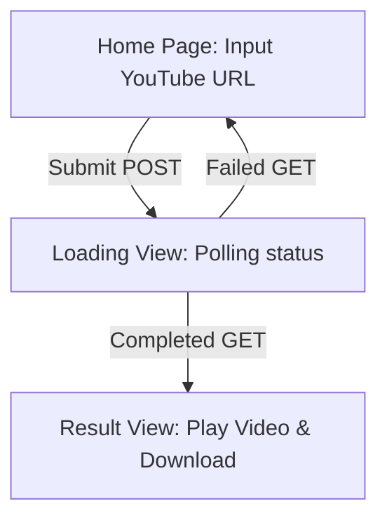

# Flutter Web Frontend — Implementation Plan (Step-by-Step)

> **Tujuan Dokumen:** Memberikan panduan dan instruksi teknis yang presisi untuk membangun antarmuka web (MVP) menggunakan Flutter. Frontend ini akan berinteraksi dengan backend Local AI Clipper (Go) secara asinkron (polling) dan menyajikan pengalaman pengguna yang modern, premium, serta responsif.

> **PENTING:** Sebelum mengeksekusi fase apa pun di bawah ini, agen **WAJIB** membaca dan mematuhi seluruh aturan penulisan kode yang ada di file `/docs/code-convention.md`.

---

## 🎯 Gambaran Umum Aplikasi
Klien Flutter Web akan menjadi dashboard single-page yang elegan dengan visualisasi proses yang interaktif:


---

## ⚙️ Referensi Arsitektur & Folder

Struktur folder mengadopsi pola **Feature-Based (Slicing by Feature)** agar modular dan mudah dikembangkan:

```text
ClipperAi/frontend/
├── web/                         # Konfigurasi Web Flutter standar
├── lib/
│   ├── core/
│   │   ├── api_client.dart       # Client HTTP menggunakan Dio
│   │   └── theme.dart            # Sistem Desain & Dark Theme Premium
│   ├── features/
│   │   └── clip_generator/
│   │       ├── models/
│   │       │   └── job_response.dart # Model data untuk JSON backend
│   │       ├── providers/
│   │       │   └── clip_provider.dart # Pengelola state & polling logic
│   │       └── views/
│   │           ├── home_page.dart     # Entry point view & layout wrapper
│   │           ├── loading_view.dart  # Tampilan animasi transisi status
│   │           └── result_view.dart   # Video Player & tombol Download/Copy
│   └── main.dart                 # Setup & entry point aplikasi
├── pubspec.yaml                 # Dependensi proyek
└── README.md
```

---

## 🚀 FASE 0: Inisialisasi Proyek & Dependencies

### Tugas:
1. Buat proyek Flutter baru dengan target **Web** di dalam folder `ClipperAi/frontend/`:
   ```bash
   cd /Users/sgo-byan/project/ClipperAi
   flutter create --platforms=web frontend
   ```
2. Tambahkan dependencies wajib pada `pubspec.yaml` di dalam folder `frontend`:
   ```yaml
   dependencies:
     flutter:
       sdk: flutter
     dio: ^5.4.0                  # HTTP Client canggih
     provider: ^6.1.1             # State management sederhana dan clean
     media_kit: ^1.1.10           # Framework pemutar media universal
     media_kit_video: ^1.1.10     # Widget video renderer untuk media_kit
     google_fonts: ^6.1.0         # Tipografi premium modern (Inter / Outfit)
     flutter_spinkit: ^5.2.0      # Animasi loading premium
     url_launcher: ^6.2.5         # Membuka tautan eksternal (untuk download)
     flutter_dotenv: ^5.1.0       # Penanganan file konfigurasi .env secara dinamis
   ```
3. Jalankan `flutter pub get` untuk mengunduh seluruh dependensi.

---

## ⚙️ FASE 0.5: Konfigurasi Environment (`.env` & `pubspec.yaml` Assets)

Untuk menghindari *hardcoding* konfigurasi (seperti base URL backend), kita akan menggunakan file `.env` yang dibundel sebagai aset aplikasi.

### Tugas:
1. Buat file `.env` di root folder `frontend/`:
   ```env
   API_BASE_URL=http://localhost:8080
   ```
2. Daftarkan file `.env` tersebut pada bagian `assets` di file `pubspec.yaml` agar dikenali oleh Flutter:
   ```yaml
   flutter:
     assets:
       - .env
   ```

---

## 🎨 FASE 1: Premium Dark Theme & Design System (`core/theme.dart`)

Untuk memberikan impresi pertama yang memukau (*Wow Effect*), gunakan palet warna premium dark mode dengan gradasi halus (bukan hitam pekat polos) serta tipografi modern Google Fonts Inter.

```dart
// lib/core/theme.dart
import 'package:flutter/material.dart';
import 'package:google_fonts/google_fonts.dart';

class AppTheme {
  // Palette Warna
  static const Color darkBg = Color(0xFF0F0F12);       // Background pekat bernuansa ungu-abu
  static const Color cardBg = Color(0xFF181820);       // Background kartu / container
  static const Color primaryPurple = Color(0xFF8B5CF6); // Ungu neon modern
  static const Color accentCyan = Color(0xFF06B6D4);    // Cyan kontras untuk highlights
  static const Color textMain = Color(0xFFF3F4F6);     // Putih abu lembut
  static const Color textMuted = Color(0xFF9CA3AF);    // Abu-abu keterangan

  static ThemeData get darkTheme {
    return ThemeData(
      brightness: Brightness.dark,
      scaffoldBackgroundColor: darkBg,
      primaryColor: primaryPurple,
      colorScheme: const ColorScheme.dark(
        primary: primaryPurple,
        secondary: accentCyan,
        surface: cardBg,
        background: darkBg,
      ),
      textTheme: GoogleFonts.interTextTheme(ThemeData.dark().textTheme).copyWith(
        displayLarge: GoogleFonts.outfit(
          fontSize: 36,
          fontWeight: FontWeight.bold,
          color: textMain,
        ),
        titleLarge: GoogleFonts.outfit(
          fontSize: 22,
          fontWeight: FontWeight.w600,
          color: textMain,
        ),
        bodyLarge: const TextStyle(fontSize: 16, color: textMain),
        bodyMedium: const TextStyle(fontSize: 14, color: textMuted),
      ),
      inputDecorationTheme: InputDecorationTheme(
        filled: true,
        fillColor: cardBg.withOpacity(0.5),
        border: OutlineInputBorder(
          borderRadius: BorderRadius.circular(16),
          borderSide: BorderSide(color: primaryPurple.withOpacity(0.3)),
        ),
        focusedBorder: OutlineInputBorder(
          borderRadius: BorderRadius.circular(16),
          borderSide: const BorderSide(color: primaryPurple, width: 2),
        ),
        enabledBorder: OutlineInputBorder(
          borderRadius: BorderRadius.circular(16),
          borderSide: BorderSide(color: Colors.white.withOpacity(0.08)),
        ),
      ),
      elevatedButtonTheme: ElevatedButtonThemeData(
        style: ElevatedButtonStyleFrom(
          padding: const EdgeInsets.symmetric(horizontal: 28, vertical: 20),
          shape: RoundedRectangleBorder(
            borderRadius: BorderRadius.circular(16),
          ),
          backgroundColor: primaryPurple,
          foregroundColor: Colors.white,
        ),
      ),
    );
  }
}
```

---

## 📡 FASE 2: API Client Wrapper (`core/api_client.dart`)

Buat wrapper HTTP menggunakan `Dio`. Kita membaca nilai `API_BASE_URL` secara dinamis dari file `.env` yang dimuat menggunakan package `flutter_dotenv`.

```dart
// lib/core/api_client.dart
import 'package:dio/dio.dart';
import 'package:flutter_dotenv/flutter_dotenv.dart';

class ApiClient {
  final Dio dio;

  ApiClient()
      : dio = Dio(
          BaseOptions(
            baseUrl: dotenv.env['API_BASE_URL'] ?? 'http://localhost:8080',
            connectTimeout: const Duration(seconds: 15),
            receiveTimeout: const Duration(seconds: 30),
            headers: {
              'Accept': 'application/json',
              'Content-Type': 'application/json',
            },
          ),
        );
}
```

---

## 📦 FASE 3: Data Model (`features/clip_generator/models/job_response.dart`)

Model data ini memetakan format JSON respons status yang dikembalikan oleh server Go.

### Response JSON dari GET `/api/v1/clips/:id`:
```json
{
  "id": "758509c3-...",
  "status": "processing",
  "video_path": "outputs/output_clip_758509c3-....mp4",
  "error": "Reason description if status is failed"
}
```

### Implementasi Dart Model:
```dart
// lib/features/clip_generator/models/job_response.dart

enum ClipStatus { processing, completed, failed, unknown }

class JobResponse {
  final String id;
  final ClipStatus status;
  final String? videoPath;
  final String? error;

  JobResponse({
    required this.id,
    required this.status,
    this.videoPath,
    this.error,
  });

  factory JobResponse.fromJson(Map<String, dynamic> json) {
    ClipStatus mappedStatus;
    switch (json['status']) {
      case 'processing':
        mappedStatus = ClipStatus.processing;
        break;
      case 'completed':
        mappedStatus = ClipStatus.completed;
        break;
      case 'failed':
        mappedStatus = ClipStatus.failed;
        break;
      default:
        mappedStatus = ClipStatus.unknown;
    }

    return JobResponse(
      id: json['id'] ?? '',
      status: mappedStatus,
      videoPath: json['video_path'],
      error: json['error'],
    );
  }
}
```

---

## 🧠 FASE 4: State Management & Polling Engine (`features/clip_generator/providers/clip_provider.dart`)

Pengelola state utama yang menangani flow pendaftaran URL video baru dan polling berkala setiap 3 detik.

```dart
// lib/features/clip_generator/providers/clip_provider.dart
import 'dart:async';
import 'package:flutter/material.dart';
import 'package:dio/dio.dart';
import '../../../core/api_client.dart';
import '../models/job_response.dart';

enum UIState { idle, submitting, loading, result, error }

class ClipProvider extends ChangeNotifier {
  final ApiClient _apiClient = ApiClient();
  
  UIState _state = UIState.idle;
  UIState get state => _state;

  String? _jobId;
  String? get jobId => _jobId;

  String? _videoUrl;
  String? get videoUrl => _videoUrl;

  String? _errorMessage;
  String? get errorMessage => _errorMessage;

  Timer? _pollingTimer;

  // Submit URL YouTube untuk memicu pembuatan clip
  Future<void> submitYoutubeUrl(String youtubeUrl) async {
    _state = UIState.submitting;
    _errorMessage = null;
    _jobId = null;
    _videoUrl = null;
    notifyListeners();

    try {
      final response = await _apiClient.dio.post(
        '/api/v1/clips',
        data: {'youtube_url': youtubeUrl},
      );

      if (response.statusCode == 202) {
        _jobId = response.data['job_id'];
        _state = UIState.loading;
        notifyListeners();
        
        // Memulai asinkron polling status
        _startPolling(_jobId!);
      } else {
        throw Exception('Server returned status code: ${response.statusCode}');
      }
    } on DioException catch (e) {
      _handleError(e.message ?? 'Gagal menghubungi server.');
    } catch (e) {
      _handleError(e.toString());
    }
  }

  // Polling Engine: Periksa status backend setiap 3 detik
  void _startPolling(String id) {
    _pollingTimer?.cancel();
    _pollingTimer = Timer.periodic(const Duration(seconds: 3), (timer) async {
      try {
        final response = await _apiClient.dio.get('/api/v1/clips/$id');
        
        if (response.statusCode == 200) {
          final job = JobResponse.fromJson(response.data);
          
          if (job.status == ClipStatus.completed) {
            timer.cancel();
            // Prefix output path dengan base URL backend
            final path = job.videoPath ?? '';
            final cleanPath = path.startsWith('/') ? path : '/$path';
            _videoUrl = '${_apiClient.dio.options.baseUrl}$cleanPath';
            
            _state = UIState.result;
            notifyListeners();
          } else if (job.status == ClipStatus.failed) {
            timer.cancel();
            _handleError(job.error ?? 'Backend gagal memproses klip video.');
          }
          // Jika masih 'processing', biarkan timer terus berjalan
        }
      } catch (e) {
        // Toleransi error jaringan temporer saat polling,
        // jangan langsung batalkan timer kecuali error berturut-turut.
      }
    });
  }

  void _handleError(String message) {
    _pollingTimer?.cancel();
    _errorMessage = message;
    _state = UIState.error;
    notifyListeners();
  }

  // Reset state agar pengguna bisa memproses video baru
  void reset() {
    _pollingTimer?.cancel();
    _state = UIState.idle;
    _jobId = null;
    _videoUrl = null;
    _errorMessage = null;
    notifyListeners();
  }

  @override
  void dispose() {
    _pollingTimer?.cancel();
    super.dispose();
  }
}
```

---

## 🖥️ FASE 5: UI Utama & Layout (`features/clip_generator/views/home_page.dart`)

Halaman utama yang menampilkan logo mewah, input text bernuansa modern, serta menampung pergantian widget/view secara dinamis berdasarkan state.

```dart
// lib/features/clip_generator/views/home_page.dart
import 'package:flutter/material.dart';
import 'package:provider/provider.dart';
import '../providers/clip_provider.dart';
import 'loading_view.dart';
import 'result_view.dart';

class HomePage extends StatefulWidget {
  const HomePage({super.key});

  @override
  State<HomePage> createState() => _HomePageState();
}

class _HomePageState extends State<HomePage> {
  final TextEditingController _urlController = TextEditingController();
  final _formKey = GlobalKey<FormState>();

  @override
  void dispose() {
    _urlController.dispose();
    super.dispose();
  }

  @override
  Widget build(BuildContext context) {
    final provider = Provider.of<ClipProvider>(context);

    // Dynamic state rendering
    switch (provider.state) {
      case UIState.loading:
        return const Scaffold(body: LoadingView());
      case UIState.result:
        return const Scaffold(body: ResultView());
      default:
        return Scaffold(
          body: Stack(
            children: [
              // Efek Background Gradasi Elegan
              Container(
                decoration: const BoxDecoration(
                  gradient: LinearGradient(
                    colors: [Color(0xFF0F0F12), Color(0xFF1F1A3A)],
                    begin: Alignment.topLeft,
                    end: Alignment.bottomRight,
                  ),
                ),
              ),
              Center(
                child: SingleChildScrollView(
                  padding: const EdgeInsets.all(24.0),
                  child: Container(
                    constraints: const BoxConstraints(maxWidth: 600),
                    child: Card(
                      color: Theme.of(context).cardColor.withOpacity(0.85),
                      elevation: 32,
                      shadowColor: Colors.black.withOpacity(0.5),
                      shape: RoundedRectangleBorder(
                        borderRadius: BorderRadius.circular(28),
                        side: BorderSide(
                          color: Theme.of(context).primaryColor.withOpacity(0.1),
                        ),
                      ),
                      child: Padding(
                        padding: const EdgeInsets.symmetric(
                          horizontal: 40,
                          vertical: 48,
                        ),
                        child: Form(
                          key: _formKey,
                          child: Column(
                            mainAxisSize: MainAxisSize.min,
                            children: [
                              // Header Logo & Glow Effect
                              _buildHeader(context),
                              const SizedBox(height: 48),
                              
                              // Input URL
                              TextFormField(
                                controller: _urlController,
                                keyboardType: TextInputType.url,
                                decoration: const InputDecoration(
                                  hintText: 'Masukkan link YouTube (e.g., https://...)',
                                  prefixIcon: Icon(Icons.link, color: Colors.grey),
                                ),
                                validator: (value) {
                                  if (value == null || value.trim().isEmpty) {
                                    return 'Tautan URL tidak boleh kosong';
                                  }
                                  if (!value.contains('youtube.com') &&
                                      !value.contains('youtu.be')) {
                                    return 'Harap masukkan tautan YouTube yang valid';
                                  }
                                  return null;
                                },
                              ),
                              const SizedBox(height: 24),
                              
                              // Pilihan Layout
                              const Text('Pilih Tipe Video:', style: TextStyle(fontWeight: FontWeight.bold, fontSize: 14)),
                              const SizedBox(height: 12),
                              Wrap(
                                spacing: 12.0,
                                runSpacing: 8.0,
                                alignment: WrapAlignment.center,
                                children: [
                                  ChoiceChip(
                                    label: const Text('Solo (Vlog)'),
                                    selected: provider.selectedLayout == 'solo',
                                    onSelected: (selected) {
                                      if (selected) provider.setLayout('solo');
                                    },
                                    selectedColor: Theme.of(context).primaryColor.withOpacity(0.2),
                                    side: BorderSide(
                                      color: provider.selectedLayout == 'solo' 
                                          ? Theme.of(context).primaryColor 
                                          : Colors.grey.withOpacity(0.3),
                                    ),
                                  ),
                                  // (Tambahkan chip untuk 'presentation' dan 'podcast' di sini)
                                ],
                              ),
                              const SizedBox(height: 24),
                              
                              // Error Banner
                              if (provider.state == UIState.error) ...[
                                Container(
                                  padding: const EdgeInsets.all(16),
                                  decoration: BoxDecoration(
                                    color: Colors.red.withOpacity(0.1),
                                    borderRadius: BorderRadius.circular(12),
                                    border: BorderSide(
                                      color: Colors.red.withOpacity(0.3),
                                    ),
                                  ),
                                  child: Row(
                                    children: [
                                      const Icon(Icons.error_outline, color: Colors.redAccent),
                                      const SizedBox(width: 12),
                                      Expanded(
                                        child: Text(
                                          provider.errorMessage ?? 'Terjadi kesalahan sistem.',
                                          style: const TextStyle(color: Colors.redAccent),
                                        ),
                                      ),
                                    ],
                                  ),
                                ),
                                const SizedBox(height: 24),
                              ],

                              // Submit Button
                              SizedBox(
                                width: double.infinity,
                                child: Container(
                                  decoration: BoxDecoration(
                                    borderRadius: BorderRadius.circular(16),
                                    boxShadow: [
                                      BoxShadow(
                                        color: Theme.of(context).primaryColor.withOpacity(0.4),
                                        blurRadius: 16,
                                        offset: const Offset(0, 4),
                                      ),
                                    ],
                                  ),
                                  child: ElevatedButton(
                                    onPressed: provider.state == UIState.submitting
                                        ? null
                                        : () {
                                            if (_formKey.currentState!.validate()) {
                                              provider.submitYoutubeUrl(
                                                _urlController.text.trim(),
                                              );
                                            }
                                          },
                                    child: provider.state == UIState.submitting
                                        ? const SizedBox(
                                            height: 20,
                                            width: 20,
                                            child: CircularProgressIndicator(
                                              strokeWidth: 2,
                                              valueColor: AlwaysStoppedAnimation(Colors.white),
                                            ),
                                          )
                                        : const Text(
                                            'Gunting Video Menjadi Vertical Clip ⚡',
                                            style: TextStyle(
                                              fontSize: 16,
                                              fontWeight: FontWeight.bold,
                                              letterSpacing: 0.5,
                                            ),
                                          ),
                                  ),
                                ),
                              ),
                            ],
                          ),
                        ),
                      ),
                    ),
                  ),
                ),
              ),
            ],
          ),
        );
    }
  }

  Widget _buildHeader(BuildContext context) {
    return Column(
      children: [
        Container(
          padding: const EdgeInsets.all(16),
          decoration: BoxDecoration(
            shape: BoxShape.circle,
            color: Theme.of(context).primaryColor.withOpacity(0.1),
          ),
          child: Icon(
            Icons.movie_filter_rounded,
            size: 56,
            color: Theme.of(context).primaryColor,
          ),
        ),
        const SizedBox(height: 24),
        Text(
          'Local AI Clipper',
          style: Theme.of(context).textTheme.displayLarge,
        ),
        const SizedBox(height: 8),
        Text(
          'Ekstrak momen terbaik YouTube menjadi video 9:16 menggunakan kecerdasan buatan lokal.',
          textAlign: TextAlign.center,
          style: Theme.of(context).textTheme.bodyMedium,
        ),
      ],
    );
  }
}
```

---

## ⏳ FASE 6: State Views (Loading & Result)

### 1. Animasi Status Dinamis (`features/clip_generator/views/loading_view.dart`)
Tampilan loading premium yang memberi tahu pengguna tentang perkembangan di backend (Download -> Analysis -> Slicing).

```dart
// lib/features/clip_generator/views/loading_view.dart
import 'package:flutter/material.dart';
import 'package:flutter_spinkit/flutter_spinkit.dart';
import 'package:provider/provider.dart';
import '../providers/clip_provider.dart';

class LoadingView extends StatelessWidget {
  const LoadingView({super.key});

  @override
  Widget build(BuildContext context) {
    final provider = Provider.of<ClipProvider>(context);

    return Container(
      decoration: const BoxDecoration(
        gradient: LinearGradient(
          colors: [Color(0xFF0F0F12), Color(0xFF1F1A3A)],
          begin: Alignment.topLeft,
          end: Alignment.bottomRight,
        ),
      ),
      child: Center(
        child: Padding(
          padding: const EdgeInsets.all(24.0),
          child: Column(
            mainAxisAlignment: MainAxisAlignment.center,
            children: [
              // Neon Spin Animation
              SpinKitDoubleBounce(
                color: Theme.of(context).primaryColor,
                size: 90.0,
              ),
              const SizedBox(height: 48),
              
              const Text(
                'AI Sedang Memproses Klip Anda...',
                style: TextStyle(
                  fontSize: 24,
                  fontWeight: FontWeight.bold,
                  letterSpacing: 0.5,
                ),
              ),
              const SizedBox(height: 16),
              
              Container(
                constraints: const BoxConstraints(maxWidth: 450),
                child: const Text(
                  'Server lokal sedang mendownload transcript, melakukan evaluasi heuristik, '
                  'meminta analisis model LLM Ollama, mengunduh segmen video, dan menerapkan crop 9:16 '
                  'melalui FFmpeg. Proses ini membutuhkan waktu sekitar 1-3 menit.',
                  textAlign: TextAlign.center,
                  style: TextStyle(color: Colors.grey, height: 1.5),
                ),
              ),
              const SizedBox(height: 32),
              
              // Tampilkan Job ID sebagai tanda proses aktif
              Container(
                padding: const EdgeInsets.symmetric(horizontal: 16, vertical: 8),
                decoration: BoxDecoration(
                  color: Colors.white.withOpacity(0.05),
                  borderRadius: BorderRadius.circular(20),
                ),
                child: Text(
                  'Job ID: ${provider.jobId}',
                  style: const TextStyle(fontFamily: 'monospace', fontSize: 12, color: Colors.grey),
                ),
              ),
              const SizedBox(height: 40),
              
              // Tombol Batal
              TextButton.icon(
                onPressed: () => provider.reset(),
                icon: const Icon(Icons.cancel_outlined, color: Colors.redAccent),
                label: const Text(
                  'Batalkan & Kembali',
                  style: TextStyle(color: Colors.redAccent, fontWeight: FontWeight.w600),
                ),
              ),
            ],
          ),
        ),
      ),
    );
  }
}
```

### 2. Video Player Modern (`features/clip_generator/views/result_view.dart`)
Menggunakan `media_kit` untuk memutar klip vertikal hasil rendering lokal.

```dart
// lib/features/clip_generator/views/result_view.dart
import 'package:flutter/material.dart';
import 'package:provider/provider.dart';
import 'package:media_kit/media_kit.dart';
import 'package:media_kit_video/media_kit_video.dart';
import 'package:url_launcher/url_launcher.dart';
import 'package:flutter/services.dart';
import '../providers/clip_provider.dart';

class ResultView extends StatefulWidget {
  const ResultView({super.key});

  @override
  State<ResultView> createState() => _ResultViewState();
}

class _ResultViewState extends State<ResultView> {
  late final Player player;
  late final VideoController controller;

  @override
  void initState() {
    super.initState();
    final provider = Provider.of<ClipProvider>(context, listen: false);
    
    // Inisialisasi Player MediaKit
    player = Player();
    controller = VideoController(player);

    // Main video url dari state provider (Autoplay dinonaktifkan di awal sesuai web policy)
    player.open(Media(provider.videoUrl ?? ''));
  }

  @override
  void dispose() {
    player.dispose();
    super.dispose();
  }

  Future<void> _downloadVideo(String url) async {
    final uri = Uri.parse(url);
    if (await canLaunchUrl(uri)) {
      await launchUrl(uri, mode: LaunchMode.externalApplication);
    } else {
      if (!mounted) return;
      ScaffoldMessenger.of(context).showSnackBar(
        const SnackBar(content: Text('Gagal membuka link unduh.')),
      );
    }
  }

  void _copyToClipboard(String url) {
    Clipboard.setData(ClipboardData(text: url));
    ScaffoldMessenger.of(context).showSnackBar(
      const SnackBar(content: Text('Tautan video berhasil disalin ke clipboard! 📋')),
    );
  }

  @override
  Widget build(BuildContext context) {
    final provider = Provider.of<ClipProvider>(context);

    return Container(
      color: Colors.black,
      child: Center(
        child: ConstrainedBox(
          constraints: const BoxConstraints(maxWidth: 450),
          child: Stack(
            children: [
              // Layer 1: Video Player (Background)
              Positioned.fill(
                child: Video(
                  controller: controller,
                  fit: BoxFit.cover,
                  controls: NoVideoControls, // UI bersih ala TikTok
                ),
              ),

              // Layer 2: Gradient Overlay
              const _GradientOverlay(),

              // Layer 3: Text Content (Pojok Kiri Bawah)
              const _TikTokTextInfo(),

              // Layer 4: Action Buttons (Kolom Kanan Bawah)
              _TikTokActionColumn(
                onDownload: () => _downloadVideo(provider.videoUrl ?? ''),
                onCopyLink: () => _copyToClipboard(provider.videoUrl ?? ''),
                onReset: () => provider.reset(),
              ),
            ],
          ),
        ),
      ),
    );
  }
}

class _GradientOverlay extends StatelessWidget {
  const _GradientOverlay();

  @override
  Widget build(BuildContext context) {
    return const Positioned.fill(
      child: DecoratedBox(
        decoration: BoxDecoration(
          gradient: LinearGradient(
            colors: [Colors.transparent, Colors.transparent, Colors.black54, Colors.black87],
            stops: [0.0, 0.6, 0.85, 1.0],
            begin: Alignment.topCenter,
            end: Alignment.bottomCenter,
          ),
        ),
      ),
    );
  }
}

class _TikTokTextInfo extends StatelessWidget {
  const _TikTokTextInfo();

  @override
  Widget build(BuildContext context) {
    return Positioned(
      bottom: 20, left: 16, right: 80,
      child: Column(
        crossAxisAlignment: CrossAxisAlignment.start,
        mainAxisSize: MainAxisSize.min,
        children: [
          Container(
            padding: const EdgeInsets.symmetric(horizontal: 10, vertical: 6),
            decoration: BoxDecoration(color: Colors.white.withOpacity(0.2), borderRadius: BorderRadius.circular(16)),
            child: const Text('SUKSES DI-GENERATE 🎉', style: TextStyle(color: Colors.white, fontWeight: FontWeight.bold, fontSize: 10)),
          ),
          const SizedBox(height: 12),
          const Text('Klip Video Anda Telah Siap!', style: TextStyle(color: Colors.white, fontWeight: FontWeight.bold, fontSize: 18)),
          const SizedBox(height: 8),
          Text('AI berhasil memotong bagian yang paling menarik dan mengoptimalkannya menjadi format vertikal 9:16.', style: TextStyle(color: Colors.white.withOpacity(0.7), fontSize: 13)),
        ],
      ),
    );
  }
}

class _TikTokActionColumn extends StatelessWidget {
  final VoidCallback onDownload, onCopyLink, onReset;
  const _TikTokActionColumn({required this.onDownload, required this.onCopyLink, required this.onReset});

  @override
  Widget build(BuildContext context) {
    return Positioned(
      bottom: 20, right: 16,
      child: Column(
        mainAxisSize: MainAxisSize.min,
        children: [
          _ActionButton(icon: Icons.download_rounded, label: 'Download', onTap: onDownload),
          const SizedBox(height: 24),
          _ActionButton(icon: Icons.link_rounded, label: 'Copy Link', onTap: onCopyLink),
          const SizedBox(height: 24),
          _ActionButton(icon: Icons.add_circle_outline_rounded, label: 'Buat Baru', onTap: onReset),
        ],
      ),
    );
  }
}

class _ActionButton extends StatelessWidget {
  final IconData icon;
  final String label;
  final VoidCallback onTap;
  const _ActionButton({required this.icon, required this.label, required this.onTap});

  @override
  Widget build(BuildContext context) {
    return GestureDetector(
      onTap: onTap,
      behavior: HitTestBehavior.opaque,
      child: Column(
        mainAxisSize: MainAxisSize.min,
        children: [
          Container(
            padding: const EdgeInsets.all(12),
            decoration: BoxDecoration(shape: BoxShape.circle, color: Colors.black.withOpacity(0.4), border: Border.all(color: Colors.white.withOpacity(0.2))),
            child: Icon(icon, color: Colors.white, size: 26),
          ),
          const SizedBox(height: 6),
          Text(label, style: const TextStyle(color: Colors.white, fontSize: 11, fontWeight: FontWeight.w600)),
        ],
      ),
    );
  }
}
```

---

## 🛠️ FASE 7: Wiring & Entrypoint (`main.dart` & Web initialization)

Gabungkan seluruh komponen ke dalam `main.dart`, muat file konfigurasi `.env`, dan aktifkan MediaKit untuk platform Web.

```dart
// lib/main.dart
import 'package:flutter/material.dart';
import 'package:provider/provider.dart';
import 'package:media_kit/media_kit.dart';
import 'package:flutter_dotenv/flutter_dotenv.dart';
import 'core/theme.dart';
import 'features/clip_generator/providers/clip_provider.dart';
import 'features/clip_generator/views/home_page.dart';

Future<void> main() async {
  // Inisialisasi Wajib untuk MediaKit
  WidgetsFlutterBinding.ensureInitialized();
  MediaKit.ensureInitialized();

  // Memuat file konfigurasi environment (.env) secara asinkron sebelum widget dirender
  await dotenv.load(fileName: ".env");

  runApp(
    MultiProvider(
      providers: [
        ChangeNotifierProvider(create: (_) => ClipProvider()),
      ],
      child: const ClipperApp(),
    ),
  );
}

class ClipperApp extends StatelessWidget {
  const ClipperApp({super.key});

  @override
  Widget build(BuildContext context) {
    return MaterialApp(
      title: 'Local AI Clipper',
      debugShowCheckedModeBanner: false,
      theme: AppTheme.darkTheme,
      home: const HomePage(),
    );
  }
}
```

---

## 🌐 FASE 8: Constraint Flutter Web & CORS

### 1. Web Renderer
Sangat direkomendasikan menjalankan Flutter Web dengan HTML Renderer agar performa rendering video canvas berjalan mulus pada platform desktop:
```bash
flutter run -d chrome --web-renderer html
```

### 2. Penanganan Web Autoplay Policy
Sebagian besar browser modern (Chrome, Safari, Edge) melarang pemutaran video bersuara secara otomatis (*autoplay with sound*). Oleh karena itu:
- MediaKit tidak melakukan `.play()` secara asinkron setelah `.open()`.
- Pengguna harus menekan tombol Play secara manual, atau pengembang dapat memilih melakukan *mute* default jika autoplay dipaksakan.

---

## 🧪 Rencana Verifikasi (Manual & Automated)

### 1. Uji Coba Integrasi Lokal
1. **Langkah 1:** Jalankan Backend Go lokal pada port `8080` (pastikan backend aktif dan Ollama berjalan).
2. **Langkah 2:** Jalankan Flutter Web di folder `frontend`:
   ```bash
   flutter run -d chrome --web-renderer html
   ```
3. **Langkah 3:** Masukkan link YouTube uji coba (misalnya video wawancara berdurasi 5-10 menit).
4. **Langkah 4:** Kirim request, pastikan UI bertransisi ke tampilan loading spin.
5. **Langkah 5:** Pantau terminal Go dan pastikan polling GET mengembalikan status `processing` berkala setiap 3 detik.
6. **Langkah 6:** Setelah pemrosesan FFmpeg selesai, pastikan UI Flutter bertransisi ke layar pemutar video, video dapat dimuat tanpa error CORS, dan tombol download berhasil mengunduh file `.mp4`.
